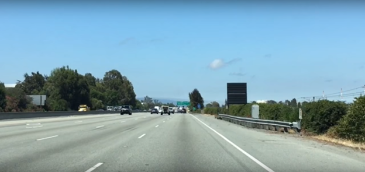
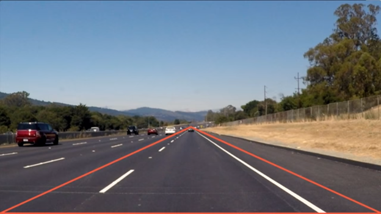
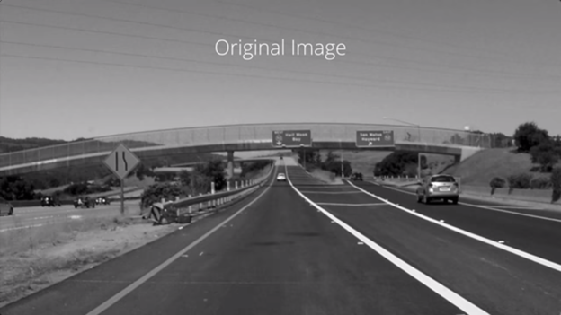
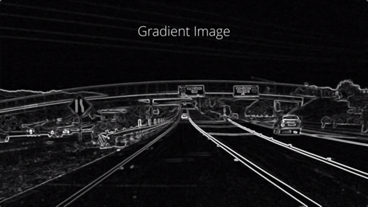
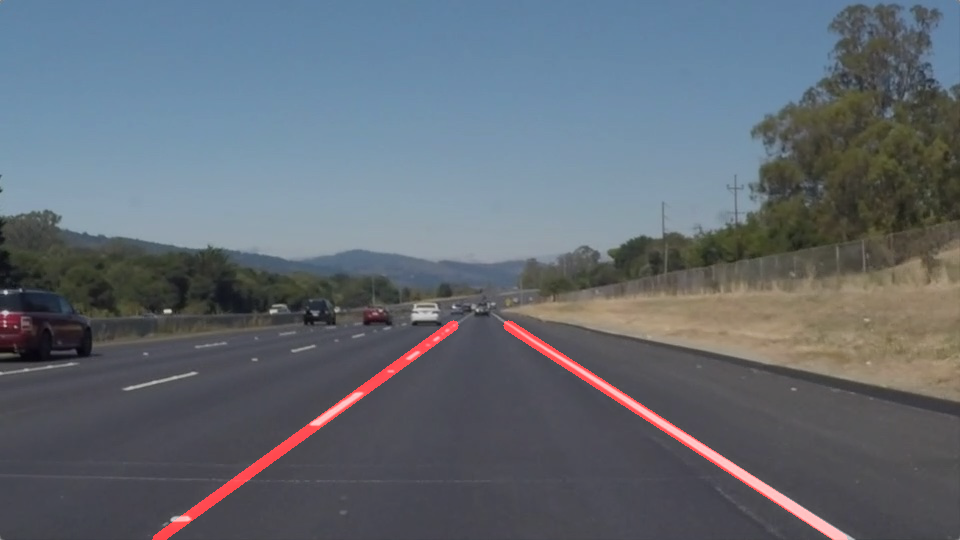

***
# Finding Lane Lines on the Road 
---
## Overview 
---
***
When we drive a car, we use our eyes to see on the road. One of the first thing we need to drive is to keep track of lane lines on the road. Coming up to self-driving cars or driving assistance systems we need the system should track the lane lines to stay on its track. 
Our job is to teach the car how to drive itself in order to do that we have to teach the car how to perceive the world around it now when we drive we figure out how fast to drive where the lane lines are? And where to turn?  
The goals steps of this project are the following:

•	Make a pipeline that finds lane lines on the road

A car doesn’t have eyes but in self-driving cars we use cameras and other sensors to achieve a similar function. Now let’s see what the cameras sees around them. We can see the things automatically. So here our goal is to teach the car to identify and track the position of the lane lines in a series of images.
Here are some of the features we can identify on the road in order to find lane lines on the road: 

•	Color

•	Shape

•	Orientation 

•	Position in Image
<figure>
 
 <figcaption>
 

 
 
 This is a sample image to detect road lines on. 
 
</figcaption>

---
***
## Color Selection 
---
*** 
For starting point, now Let’s try finding the lane lines using the color. The lane lines are usually white. To select a color, We actually sees, need to identify what it means in digital image. In digital domain images are made up of stack of three images: 

•	Red 

•	Green 

•	Blue
<figure>
 
 <figcaption>
 

 
 
RGB Image
 
 </figcaption>
The images are sometime called color channels. Each of these color have values from 0-255 where 0 is the darkest possible value and 255 is the brightest possible values. If zero is dark and brightest is 255 than white will be [255,255,255]. Now getting this we define threshold for RGB image for white.
<figure>
 
 <figcaption>
 

 
 
RGB Image after Color Thresholding
 
 </figcaption>
 
---
***
## Masking 
---
***
Now let’s focus on the region of the image which interests us. Namely the regions where the lane lines are. In this case we can assume the camera is mounted in front of the image and it took the image and region stays the same for every single image taken.
<figure>
 
 <figcaption>
 

 
 
 Masking the image to get some region of interest
 
</figcaption>
Now we've seen how to mask out a region of interest in an image. Next, let's combine the mask and color selection to pull only the lane lines out of the image.
<figure>
 
 <figcaption>
 

 
 
 Color Selction and Masking Combined
 
 </figcaption>
 
---
***
## Computer Vision 
---
***
As it happens, lane lines are not always the same color, and even lines of the same color under different lighting conditions (day, night, etc.) may fail to be detected by our simple color selection.
What we need is to take our algorithm to the next level to detect lines of any color using sophisticated computer vision methods.
We will be using Python with OpenCV for computer vision work. OpenCV stands for Open-Source Computer Vision. 
*You can download the files following instructions at the end of this document.
<figure>
 
 <figcaption>
 

 
 
 
 
 </figcaption>
OpenCV contains extensive libraries of functions that you can use. The OpenCV libraries are well documented, so if you’re ever feeling confused about what the parameters in a particular function are doing, or anything else, you can find a wealth of information at opencv.org.

---
***
## Edge Detection 
---
***
With edge detection our goal is to identify the boundaries of an image. So to do that first we convert to gray scale. And next we compute the gradient. In gradients the brightness of each pixels corresponds to the strength of the gradient at that point we will define edges by tracing out the pixels that follows the strongest gradient. By identifying edges we can even more easily detect object with their shapes.
<figure>
 
 <figcaption>
 

 
 
 Example Image
 
</figcaption>
<figure>
 
 <figcaption>
 

 
 
 Gray Scale
 
 </figcaption>
<figure>
 
 <figcaption>
 

 
 
 Gradient Image
 
 </figcaption>
---
***
## Hough Transform 
---
***
After doing edge detection the function gives edges in the form of dots. And these dots represents edges. Now it’s time to connect the dots. We could connect the dots with any kind of shapes in the image. For in this case we are interested in lane lines. To find lines we need to adapt a model of a line to the assortment of dots in our edge detected image keeping in mind image is a mathematical function we can apply equation of line.

y = mx+b
In this case our model have two parameters m and b in image space a line is plotted x vs. y but in parameter space which we will call Hough space. In Hough space we can represent the same line as m vs. b instead. The Hough transform is just conversion from image space to Hough space. So characterization of a single line will be a point at a position m, b in Hough space. 
so our strategy to find lines in image space will be to find intersecting lines in Hough space we do this by dividing up the Hough space into a grid and define intersecting lines as all lines passing through a given grid cell. To do this first we run canny edge on our image and then finding lines in Hough space on edge detected image 

In this case, we are operating on the image masked edges (the output from Canny) and the output from HoughLinesP will be lines, which will simply be an array containing the endpoints (x1, y1, x2, y2) of all line segments detected by the transform operation. The other parameters define just what kind of line segments we're looking for. 

<figure>
 
 <figcaption>
 

 
 
 Hough Transform (Detecting Some Lines in the image)
 
 </figcaption> 
<figure>
 
 <figcaption>
 

 
 
 Hough Transform to detect Lines in Region of Interest 
 
</figcaption>
As you can see I've detected lots of line segments. As in above image we have applied our technique to straight solid white lines, but what if we apply these techniques to a segmented lines the output will look some thing like:
<figure>
 
 <figcaption>
 

 
 
 Hough Transform (Detecting Some Lines in the image)
 
 </figcaption> 
---
***
## Exttrapolation 
---
***
Here we can see our algorithm does not work on segemented lines. To work on these lines we need to change our algorithm a bit. Hough transform gives solid lines as output. Taking these lines we need to design a new pipeline which can extrapolate these solid lines.
Now we will apply moving averages technique to extrapolate lines. The figure below shows how this technique works and extrapolates either the right line or left line. Figure below shows how we need to extrapolate lines with their possible extension points.
Extrapolation Algorithm steps:
* Anchor the bottom of both left and right lanes.
* Use the slope of both lines as a guide for extrapolation.
* Determine which line has the highest point (close to horizon).
* Extrapolate the other lane to match the alternate side.

<figure>
 
 <figcaption>
 

 
 
 Extrapolating Hough Lines
 
 </figcaption>
 
 
---
***
### Left Lane Extrapolation 
---
***

Xmin = Xmin

Ymin = Ymin

Xmin = (Ymax – Yintercept) / Slope

Ymax = max(Ymax , Ymax-right-lane)

---
***
### Right Lane Extrapolation 
---
***

Xmin = Xmin

Ymin = Ymin

Xmin = (Ymax – Yintercept) / Slope

Ymax = max(Ymax , Ymax-Left-lane)
<figure>
 
 <figcaption>
 

 
 
 Extrapolating Hough Lines
 
 </figcaption>

***
### Reflections
---
***
Congratulations on finding the lane lines! As the final step in this project, we would like you to share your thoughts on your lane finding pipeline... specifically, how could you imagine making your algorithm better / more robust? Where will your current algorithm be likely to fail? 

---   
***
### ShortComings 
---
***

* This approach could not work properly:
    * if the camera is placed at a different position
    * if other vehicles in front are occluding the view
    * if one or more lines are missing
    * at different weather and light condition (fog, rain, or at night).
    * More robust outlier detector is needed to be implement
 
---
***
## Improvements 
---
***
* To cater shadow or some other situations images can be sharpened so that pixel transitions resulting boarders can easily be detetcted (some high pass filters).
* instead of canny edge detection sobel edge detector can be used which is alot more robust than canny.
* Morphology can also be implemented to make the algorithm more robust.
* Histogram equalization is also another technique which can be used to increase image contrast.
* Perform a color selection in the HSV space, instead of doing it in the RGB images
* Update the ROI mask dynamically
* Perform a segmentation of the road
* If a line is not detected, we could estimate the current slope using the previous estimations and/or the other line detection

---
***
## Requirements 
---
***
* Instal Anacnda
* From conda prompt goto Finiding Lane Lines SDVND and run the following command:
    *conda env create -f virtual_environment_windows.yml
* Now open anaconda navigator from the left upper corner change from root to virtual environement
* Run Spyder
* Run the main_file.py and **enjoy!!!** 
